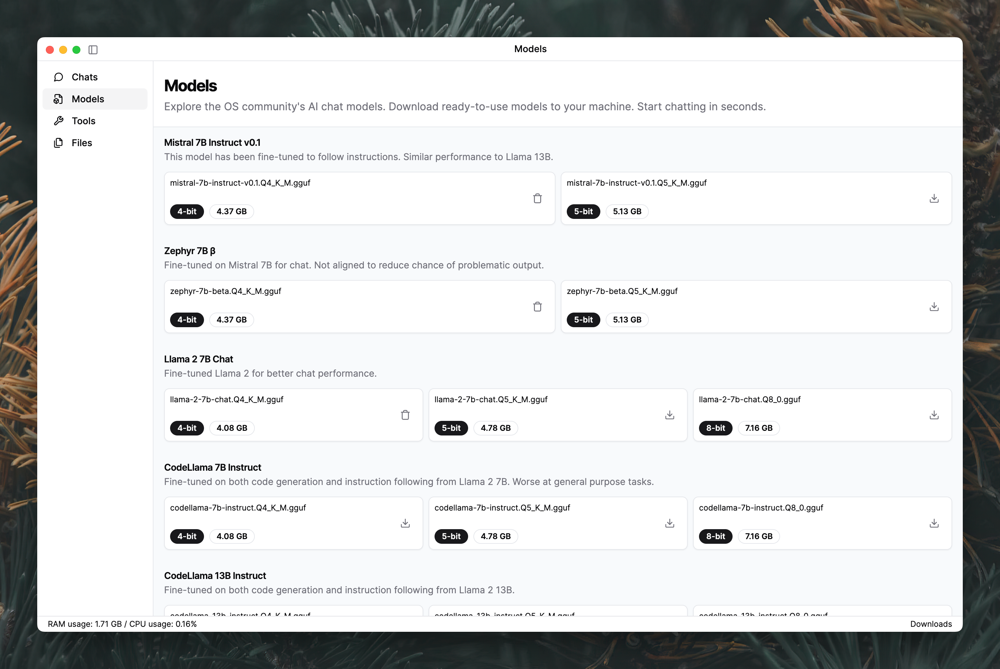
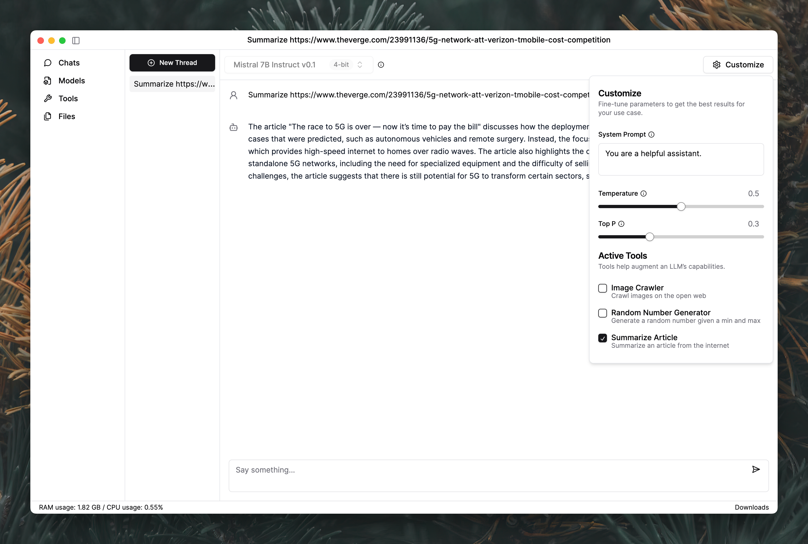
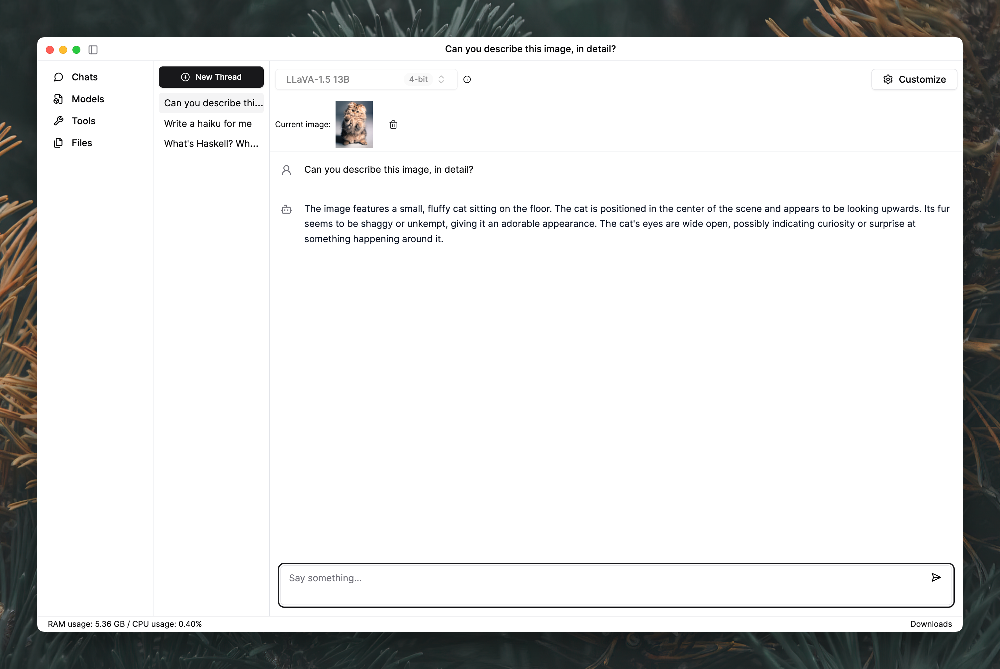
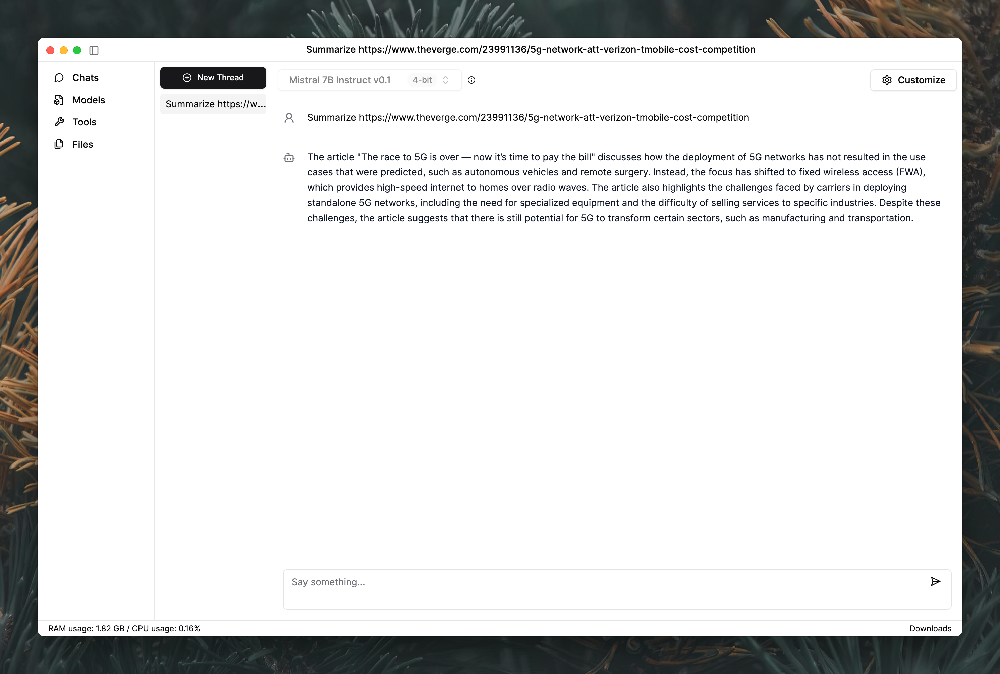
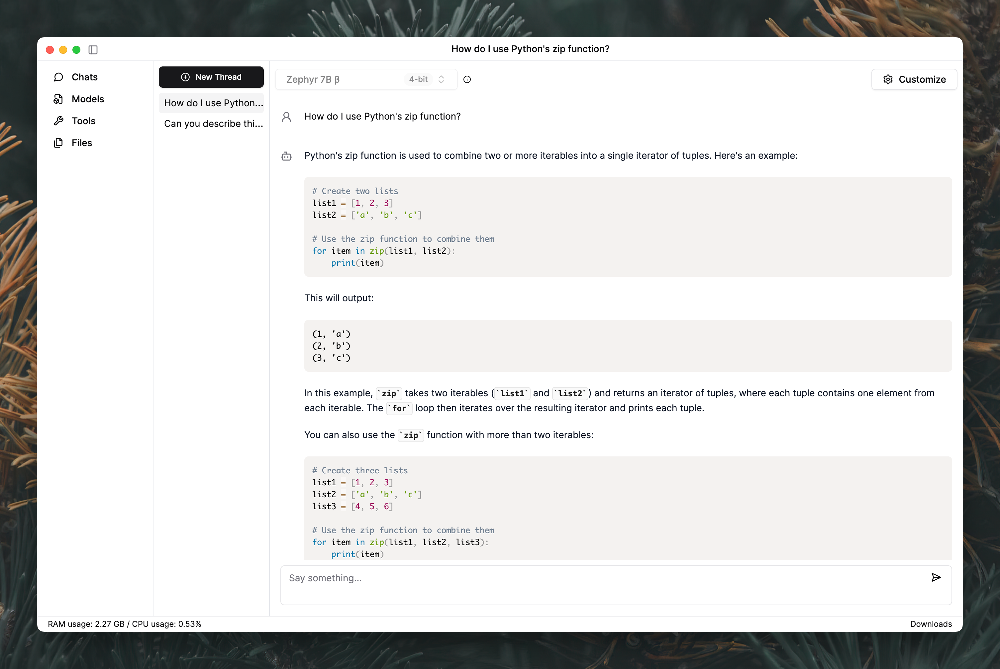

  <picture>
    <source media="(prefers-color-scheme: dark)" srcset="src/renderer/assets/logo-dark.svg">
    <source media="(prefers-color-scheme: light)" srcset="src/renderer/assets/logo-light.svg">
    
  </picture>
  

  

    Run AI models, locally.
  

Dynaboard AI Studio is an interactive AI chat system that runs entirely within your Macbook. Powered by local models, use it if you are concerned about privacy implications or vendor lock-in with other web-based models.

All llama.cpp models are supported. Download as little or as many models as you need. We don't make assumptions about your requirements, use your imagination!

  
  

  
  

  

## Installation
Dynaboard AI is pre-packaged for Apple M-series operating systems. Simply download the installer and you are ready to get started.

[Download](https://github.com/dynaboard/ai-studio/releases/download/v1.0.0-beta.1/Dynaboard.AI.Studio.1.0.0-beta.1.dmg)

### Getting Started

1. Once installed, you can download any supported model. We recommend going with the default, Mistral 7B v0.1, which is downloaded when you first start the application.
1. Go to a thread, configure parameters / system prompt.
1. Chat with the model.

#### Minimum Requirements

* macOS 13+ (Ventura)
* M-series chip with 16GB of RAM
* 5GB of free disk space (for models)

#### Recommended Requirements

* macOS 14+ (Sonoma)
* M1 Pro (or higher) with 16GB of RAM
* 20GB+ of free disk space (for models)

## Development

To get started with development, ensure you are running on an Apple M-series laptop.

1. Install dependencies: `pnpm i`
1. Run app: `pnpm dev`

